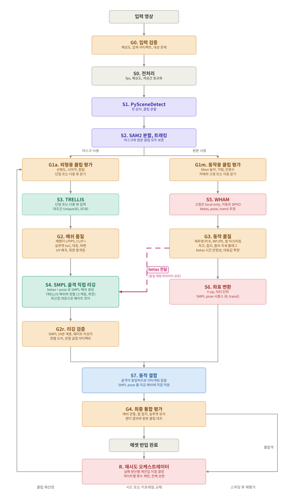
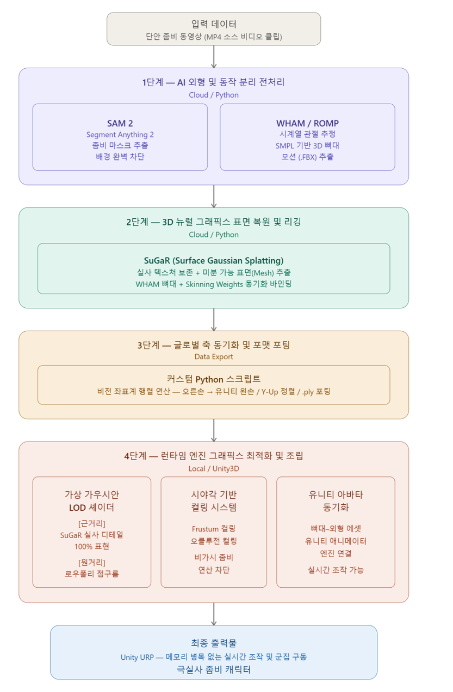
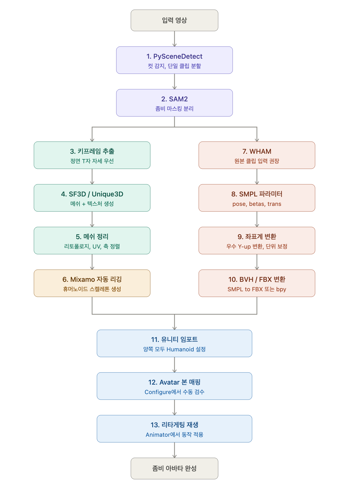
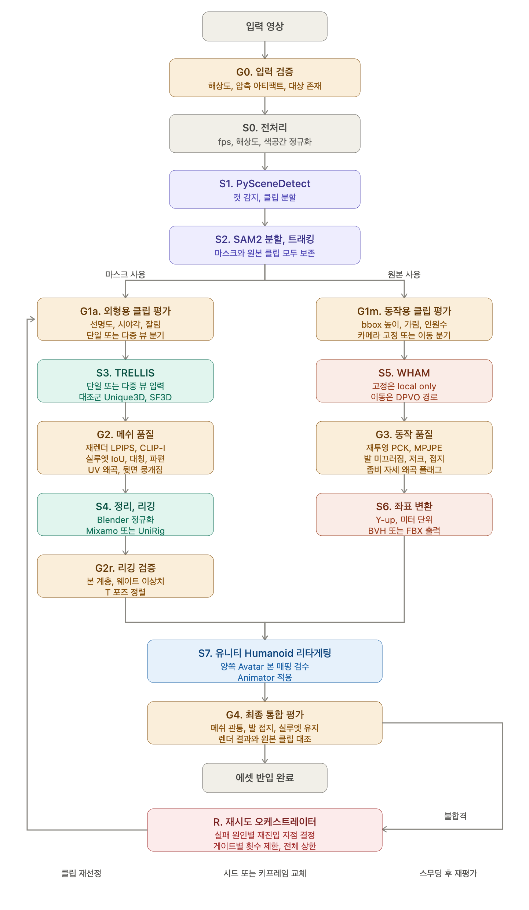
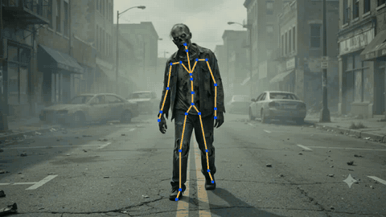
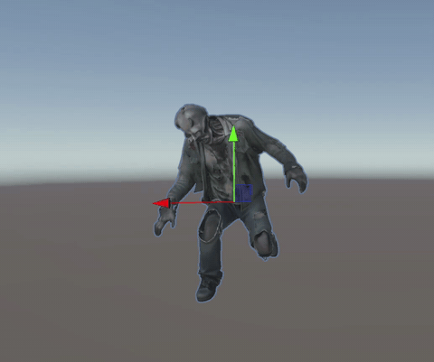
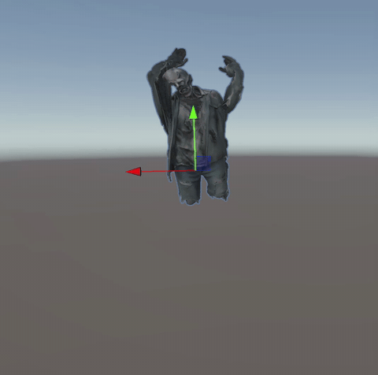

# Video2UnityAvatar-Pipeline

[Software Maestro] 좀비 영상 한 편을 입력하면 유니티 아바타 에셋(캐릭터 + 애니메이션)으로 자동 변환하는 파이프라인.

## 파이프라인 설계

### 현재 설계 (v4)


```
입력 영상
  → G0  입력 검증          해상도, 압축 아티팩트, 대상 존재
  → S0  전처리             fps / 해상도 / 색공간 정규화
  → S1  PySceneDetect      컷 감지, 클립 분할
  → S2  SAM2               분할·트래킹 (마스크와 원본 클립 모두 보존)
      │
      ├─[마스크]→ G1a 외형용 클립 평가   선명도, 시야각, 잘림
      │           → S3  TRELLIS          단일/다중 뷰 → 메쉬 + 텍스처
      │           → G2  메쉬 품질        LPIPS, CLIP-I, 실루엣 IoU, UV 왜곡
      │           → S4  SMPL 골격 직접 리깅  ←──────┐
      │              betas + pose로 SMPL 메쉬 생성  │
      │              TRELLIS 메쉬와 정렬 → 웨이트 전이│
      │           → G2r 리깅 검증        SMPL 24본 계층, 정렬 오차
      │                                              │ betas 전달
      └─[원본]──→ G1m 동작용 클립 평가   bbox 높이, 가림, 인원수
                  → S5  WHAM             betas, pose, transl 추정
                  → G3  동작 품질        재투영 PCK, MPJPE, 발 접지 ─┘
                  → S6  좌표 변환        Y-up, 미터 단위, pose 시퀀스
  → S7  동작 결합            골격이 동일하므로 리타게팅 없음
                             SMPL pose를 리깅 메쉬에 직접 적용
  → G4  최종 통합 평가       메쉬 관통, 발 접지, 원본 클립 대조
  → 에셋 반입 완료
       └→ (불합격 시) R. 재시도 오케스트레이터 → 실패 원인별 게이트 재진입
```

WHAM이 추출한 체형 파라미터(betas)를 외형 경로의 리깅 단계에 전달해
두 경로의 골격을 SMPL로 통일한다. 골격이 동일하므로 골격 간 리타게팅
단계가 구조적으로 제거된다.

### 설계 변천
| 버전 | 핵심 구성 | 전환 사유 |
|---|---|---|
| v1 (기획, 미실행) | SAM2 + SuGaR + WHAM, 가우시안 LOD 렌더링 | 조사 단계에서 SuGaR의 동적 인물 부적합 확인, 배경 3D 불필요 → 착수 전 배제 |
| v2 | Mixamo 리깅 + Unity Humanoid 리타게팅 | 실행 결과 근육 변환에서 관절 동작 소실 → 폐기 |
| v3 | 품질 게이트(G0~G4)·재시도 오케스트레이터 추가 | 평가·재시도 체계 확립, 리깅 방식은 v2 유지 |
| v4 (현재) | SMPL 골격 직접 리깅, betas 전달로 골격 통일 | 리타게팅 단계의 구조적 제거 |

<details><summary>v1 구조도 (기획)</summary>


</details>

<details><summary>v2 구조도 (리타게팅 방식)</summary>


</details>

<details><summary>v3 구조도 (게이트 추가)</summary>


</details>

상세 이력과 각 결정의 검증 근거는 [`docs/PROJECT_STATUS.md`](docs/PROJECT_STATUS.md)에 있습니다.
폐기한 리타게팅 시도는 [`scripts/deprecated/README.md`](scripts/deprecated/README.md)를 참고하세요.

## 레포 구조

| 경로 | 내용 |
|---|---|
| `docs/` | 프로젝트 문서. 설계·검증 결과·다음 단계는 [`docs/PROJECT_STATUS.md`](docs/PROJECT_STATUS.md) |
| `notebooks/sam2/` | SAM2 전처리 Colab 시행착오 노트북 (try1~try6) |
| `scripts/` | 검증된 실행 스크립트 (WHAM 실행, pkl→FBX 변환, 텍스처 추출 등) |
| `scripts/deprecated/` | 폐기된 시도 — SMPL→Mixamo 리타게팅 계열 |
| `pipeline/qa/` | 품질 게이트 및 재시도 오케스트레이터 |
| `docker/` | 환경 확정 후 굳힐 Dockerfile |

## 실행 환경

레포별 의존성이 충돌(torch 1.11~2.5, CUDA 11.3~12.4)하여 단일 환경을 쓰지 않고, 모델별로 환경을 분리합니다.
GPU 작업은 RunPod(RTX 4090, EU-RO-1) + Network Volume(`/workspace`)에서 micromamba로 구성합니다.

## 상태

- 검증 완료: WHAM 동작 복원, TRELLIS 외형 복원, 유니티 에셋 반입
- 진행 중: SMPL 골격 직접 리깅 (메쉬 생성 → 정렬 → 웨이트 전이)
- 예정: TRELLIS 로컬 설치, 품질 게이트 연결, 오케스트레이터 가동, Dockerfile 고정

## 검증 결과

### 동작 복원 (WHAM)


WHAM이 추정한 SMPL 파라미터에서 공식 J_regressor로 관절을 추출해 원본 영상에 2D 재투영한 결과입니다.
스켈레톤이 좀비 위에 정합하는 것으로 동작 복원이 정상임을 확인했습니다 (`scripts/overlay_vis.py`).

### 외형 파이프라인 → Unity 반입
| Mixamo 애니메이션 | 에셋스토어 애니메이션 (호환성) |
|---|---|
|  |  |

TRELLIS 생성 메쉬 → Mixamo 리깅 → 텍스처 → Unity Humanoid 반입.
제3자 애니메이션이 그대로 재생되어 표준 Humanoid 규격 충족을 확인.

### 통합 (SMPL 리깅 + WHAM 동작) — 진행 중
<!-- SMPL 리깅 완료 후 여기에 최종 데모 추가 -->
