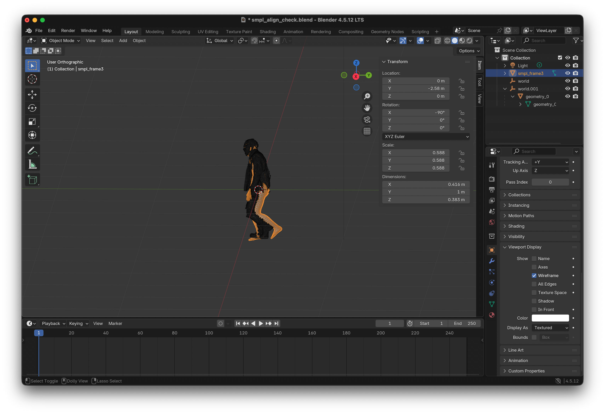
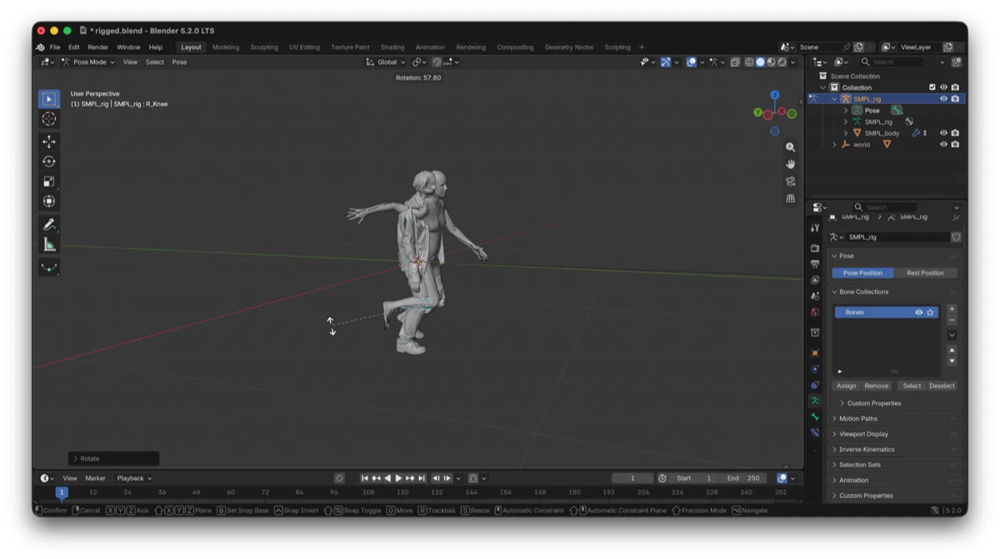
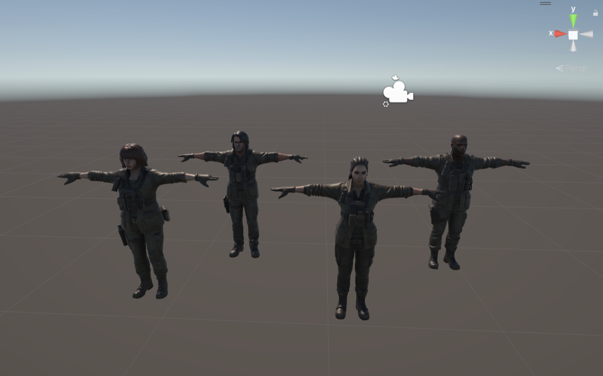
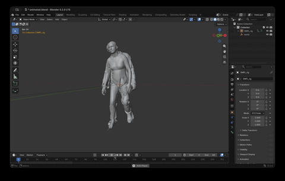
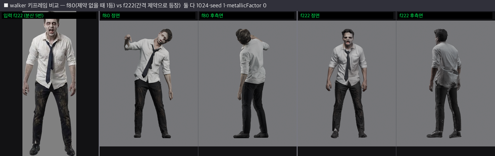
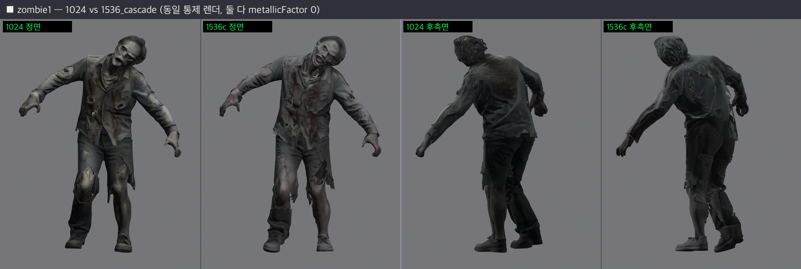

# 좀비 영상 → 유니티 아바타 파이프라인 — 진행 상황 정리

작성일: 2026-08-11 (최종 갱신: 2026-09-07)
레포: [Video2UnityAvatar-Pipeline](https://github.com/chaeee01/Video2UnityAvatar-Pipeline) — 초기 이름 `3DGS-Character-Generation-Pipeline`에서 개명. SuGaR(3DGS) 기반 복원을 설계에서 제외하면서 이름이 실제 구성과 어긋나 정리함.
목표: 좀비 영상 한 편을 입력하면 SAM2로 객체를 분리하고, TRELLIS로 외형을, WHAM으로 동작을 복원한 뒤 유니티 에셋(아바타 + 애니메이션)으로 반입하는 파이프라인 구축.

---

## 1. 최종 파이프라인 설계

기획(v1) 이후 세 차례 개정을 거쳐 확정된 v4 구조. 버전별 구조도는 [`assets/`](assets/)에 있다 ([v1](assets/pipeline_v1.png) · [v2](assets/pipeline_v2.png) · [v3](assets/pipeline_v3.png) · [v4](assets/pipeline_v4.png)).

```
입력 영상
  → G0 입력 검증
  → S0 전처리 (fps/해상도 정규화)
  → S1 PySceneDetect (컷 분할)
  → S2 SAM2 (마스킹·트래킹)
      ├→ G1a 외형용 프레임 평가 → S3 TRELLIS → G2 메쉬 평가 → S4 SMPL 골격 직접 리깅
      └→ G1m 동작용 클립 평가 → S5 WHAM → G3 동작 평가 → S6 좌표변환
                                          └─ betas 전달 ─→ S4
  → S7 동작 결합(리타게팅 없음) → G4 최종 통합 평가 → (불합격 시 게이트별 재진입)
```

### 버전별 설계 변경 이력

| 버전 | 핵심 구성 | 전환 사유 |
|---|---|---|
| v1 (기획, 미실행) | SAM2 + SuGaR + WHAM, 가우시안 LOD 렌더링 | 조사 단계에서 SuGaR의 동적 인물 부적합 확인(정적 장면 전제), 최종 목표가 아바타라 배경 3D 불필요 → 착수 전 배제 |
| v2 | Mixamo 자동 리깅 + Unity Humanoid 리타게팅 | 실행 결과 근육 변환에서 관절 동작 소실, 루트 회전만 잔존 → 폐기 (3절) |
| v3 | 품질 게이트(G0-G4)·재시도 오케스트레이터 추가 | 평가·재시도 체계 확립. 리깅 방식은 v2 유지 |
| v4 (현재) | SMPL 골격 직접 리깅, betas 전달로 골격 통일 | 리타게팅 단계의 구조적 제거 (4절) |

각 버전에 공통으로 적용된 결정:
- Unique3D/SF3D → TRELLIS 교체 — MIT 라이선스(상업 이용 가능), 단일/다중 뷰 지원, 유지보수 활발. Hunyuan3D는 한국 지역 사용 제한으로 배제.
- 외형용(G1a)과 동작용(G1m) 평가 분리(v3 이후) — 두 모델이 요구하는 입력 조건이 다르기 때문(외형: 선명한 1프레임 / 동작: 가림 없는 시퀀스).

---

## 2. 인프라 (완료)

| 항목 | 내용 |
|---|---|
| GPU | RunPod 초당 과금. RTX 4090 ($0.69/hr, EU-RO-1) 사용 중 |
| 스토리지 | Network Volume 100GB, EU-RO-1 고정. Pod 간 데이터 공유 통로 |
| 환경 구성 | 도커 이미지 대신 볼륨(`/workspace`)에 micromamba로 직접 설치. Pod을 지워도 환경이 유지되어 디버깅 사이클이 짧음. 명령이 확정되면 Dockerfile로 굳힐 예정 |
| 접속 | SSH(Direct TCP) + VSCode Remote-SSH. Pod 재배포 시 IP/포트 변경됨 |
| 검증 완료 | 볼륨 영속성 테스트 통과 (Pod terminate 후 재배포해도 데이터 유지) |

운영 규칙: Pod은 작업 후 반드시 Terminate(Stop은 스토리지 2배 과금). 모든 Pod은 EU-RO-1에서 배포. 결과 파일은 terminate 전에 맥북으로 회수.

레포별 의존성이 충돌(torch 1.11-2.5, CUDA 11.3-12.4)하여 단일 환경 불가 → 환경 분리 원칙 확정. 현재 볼륨에 wham 환경(python 3.9 + torch 2.0.0+cu118) 구축 완료.

---

## 3. 단계별 검증 결과

### 동작 복원 (WHAM) — 검증 완료
- SMPL/SMPLify 계정 인증 완료. 체크포인트·바디모델 다운로드 완료 (`/workspace/repos/WHAM`).
- `zombie_sample1.mp4`(69프레임, 2.3초)로 실행 → `wham_output.pkl` 생성.
  - pose (69,72), trans (69,3), betas (69,10), verts (69,6890,3)
  - 트랙 1개(단독 추적 성공), 포즈 표준편차 0.44(동작 확실히 포착)
- 검증: SMPL 공식 J_regressor로 관절 추출 → 원본 영상에 2D 재투영 → 좀비 위에 정확히 정합. 재투영 오차가 작음을 육안 확인.
- DPVO 미설치, `--estimate_local_only` 모드(카메라 고정 전제). 카메라 이동 영상이 필요해지면 추가.

### 외형 복원 (TRELLIS) — 검증 완료
- HF Space(무료)에서 좀비 키프레임 1장 → GLB 생성. 뒷면 품질 양호, 얼굴 디테일은 아쉬우나 좀비 컨셉상 허용 범위.
- GLB → Blender → FBX 변환 → Mixamo 자동 리깅 성공(관절 마커 수동 배치).
- Unity Humanoid 매핑 통과(필수 본 15개 전부 매핑).
- 텍스처: FBX 변환 시 누락되는 문제를 GLB 바이너리에서 직접 추출(PNG 2048×2048)하여 해결. Unity Material(URP Base Map)에 연결 완료.

### 유니티 에셋 반입 — 검증 완료
- Mixamo 캐릭터(With Skin) + Mixamo 애니메이션(Without Skin) 구조로 반입.
- 텍스처 입힌 좀비가 Mixamo 좀비 애니메이션으로 정상 동작 확인.
- "외형 + 리깅 + 텍스처 + 동작"이 유니티에서 결합되는 전체 절차 검증 완료.

### WHAM 동작의 유니티 반입 — 미해결 (유일한 미완 구간)
- pkl → FBX 변환 자체는 성공: Blender bpy 스크립트로 SMPL Unity FBX 템플릿에 동작을 구움. Blender에서 팔다리 동작 정상 재생 확인.
- 실패 지점: SMPL 골격(24본) 동작을 Mixamo 골격(65본) 캐릭터로 옮기는 리타게팅. 세 가지 방식을 시도해 모두 실패.

  | 방식 | 구현 | 결과 |
  |---|---|---|
  | Unity Humanoid 리타게팅 | Unity 에디터에서 직접 시도 (스크립트 없음) | 근육(muscle) 변환 과정에서 관절 동작 소실, 루트 회전만 잔존 |
  | Blender 행렬 계산 | `retarget_smpl_to_mixamo.py` — rest 방향 offset 보정 (`offset = src_rest⁻¹ @ tgt_rest`) | 자세 붕괴(팔 엉킴). 리그별 rest 방향 예외 처리 실패 |
  | Blender 컨스트레인트 | `retarget_constraint_based.py` — world space Copy Rotation 후 NLA 베이킹 | 두 리그의 rest가 모두 T포즈라 world space 회전 복사가 성립한다는 전제였으나 마찬가지로 자세 붕괴 |

  스크립트는 `scripts/deprecated/`에 사유와 함께 보존 ([README](../scripts/deprecated/README.md)).
- 결정: 리타게팅 경로 폐기. Mixamo 리깅은 최종 파이프라인에 들어가지 않으므로 이 다리를 고치는 데 추가 투자하지 않음 (→ 4절 v4 전환).

---

## 4. v4로의 전환: SMPL 골격 직접 리깅

v2/v3의 리타게팅 실패가 역설적으로 방향을 확정함 — 골격을 SMPL로 통일하면 리타게팅 문제 자체가 소멸.
v3까지는 외형 경로(Mixamo 65본)와 동작 경로(SMPL 24본)의 골격이 달라 S7에서 반드시 리타게팅을 거쳐야 했다.
v4는 동작 경로의 betas(체형)를 외형 경로의 리깅 단계(S4)로 전달해 양쪽 골격을 SMPL로 통일하고, S7을 리타게팅이 아닌 단순 동작 결합으로 바꾼다.

```
WHAM betas(체형) + 키프레임 pose(자세) → 그 좀비와 같은 자세·체형의 SMPL 메쉬 생성
  → TRELLIS 메쉬와 정렬 (같은 자세이므로 정렬 난이도 대폭 하락 — 핵심 아이디어)
  → 웨이트 전이 (Blender Data Transfer, Nearest Face Interpolated)
  → SMPL 골격을 가진 좀비 → WHAM 동작 무변환 재생 → Unity Humanoid 반입
```

구조도: [pipeline_v4.png](assets/pipeline_v4.png) — G3에서 S4로 향하는 `betas 전달` 경로가 v3 대비 유일한 신규 연결이며, 이 한 줄이 리타게팅 단계를 제거한다.

기대 효과: Mixamo(수동, API 없음) 제거로 완전 자동화 가능. UniRig(스키닝 모델 미공개) 의존 불필요.

예상 난관: TRELLIS 형상과 SMPL pose 재현 간 미세 불일치, 팔-몸통 근접부 웨이트 번짐(→ G1a에서 팔 벌린 키프레임 선정이 중요), SMPL 몸체 밖 요소(너덜거리는 옷)의 웨이트 처리.

---

## 5. 입력 영상 조건 (확정)

클립 전체(WHAM): 90프레임(3초) 이상·600프레임 이하, 30fps, 720p+, 인물 1명, 컷 전환 없음, bbox 높이 256px+, 가림 30% 미만, 발끝까지 프레임 안, 카메라 고정.

키프레임(TRELLIS): 클립 내 1장 이상 — 전신, 모션블러 없음, 팔이 몸통에서 떨어진 자세, 정면-3/4 측면.

충돌 해소: "팔을 벌린 채 걷는 좀비"가 양쪽 조건을 동시에 만족. 방위각 45° 이상 차이 나는 양질 프레임 2장 이상이면 다중 뷰 경로.

※ 현재 테스트 영상(69프레임)은 기준 미달. 실제 제작 시 5-10초 클립 필요.

---

## 6. 자산 목록

### 스크립트 (작성 완료)

작성된 스크립트는 모두 **레포 `scripts/`에 통합됨** (폐기분은 `scripts/deprecated/`). 볼륨·맥북에 흩어져 있던 사본을 회수해 단일 출처로 정리했다.

| 파일 | 용도 | 상태 |
|---|---|---|
| setup_wham.sh / run_wham.sh | WHAM 볼륨 설치·실행 | 검증됨 |
| overlay_vis.py | SMPL 2D 재투영 검증 | 검증됨 |
| quick_vis.py | SMPL 스켈레톤 프리뷰 (matplotlib 애니메이션) | 검증됨 |
| wham_to_smplfbx.py | WHAM pkl → 변환용 형식 | 검증됨 |
| smpl_pkl_to_fbx.py | pkl → FBX (bpy) | 변환 성공, 리타게팅 미해결 |
| retarget_smpl_to_mixamo.py / retarget_constraint_based.py | SMPL→Mixamo 리타게팅 (행렬 offset / 컨스트레인트) | 폐기 (`scripts/deprecated/`) |
| generate_smpl_mesh.py | SMPL 메쉬 생성 (키프레임 자세 + T포즈 + 관절 추출) | 검증됨 |
| align_smpl_to_trellis.py | TRELLIS-SMPL 자동 정렬 (bbox 기반 스케일·이동, IoU 검증) | 검증됨 |
| create_smpl_armature.py | SMPL 아마추어 생성·바인딩 (관절 좌표계 자동 보정) | 검증됨 |
| glb_tex.py | GLB 텍스처 추출 | 검증됨 |
| check_tex.py | Blender 텍스처 진단 | 검증됨 |
| setup_trellis.sh / run_trellis.py | TRELLIS 로컬 설치·실행 | 미실행 (Space로 대체 중), 레포 미반입 |
| gate1-3, orchestrator, config.yaml | 품질 게이트·자동화 골격 | 코드만 존재, 미연결. 자리는 `pipeline/qa/`에 확보 |

### 데이터 (Network Volume + 맥북)
- `/workspace/data/05_wham/zombie_sample1/` — wham_output.pkl, overlay.mp4 등
- 맥북: wham_output.pkl, zombie_anim2.fbx(동작 정상), GLB 원본, zombie_tex_0/1.png(구 버전 출력명, 현재는 `{glb명}_tex_N.png` 규칙), Mixamo FBX 2종
- Unity 프로젝트: 텍스처 연결된 좀비 + Mixamo 애니메이션 작동 상태

### 도구·계정
- Blender 5.2(FBX 임포터 조명 버그 있음) + 4.5 LTS(우회용) 공존 설치
- SMPL/SMPLify 계정(인증 완료), HF 계정, Mixamo(Adobe) 계정, RunPod($49+ 잔여)

---

## 7. 리스크·이슈

- **SMPL 라이선스**: 무료 버전은 비상업 연구용. 유니티 에셋 상용 배포 시 Meshcapade 상업 라이선스 필요. 프로젝트 성격 확정 전 반드시 검토.
- **SMPL prior의 좀비 자세 왜곡**: 짧은 테스트에서는 동작이 보존됐으나, 극단적 자세(기어가기, 관절 꺾임)에서 정상 자세로 회귀할 가능성. 실전 영상으로 추가 검증 필요.
- **Blender 5.2 FBX 임포터 버그**(조명 객체 파싱 실패) — 4.5로 우회 중.
- 리깅 자동화의 대안(UniRig)은 스키닝 모델 미공개 상태. SMPL 직접 리깅이 실패할 경우의 백업 부재.

---

## 8. 최근 작업

<!-- 항목은 날짜 오름차순. 새 항목은 맨 아래에 추가 -->

- **2026-08-13 — 레포 정리 완료**: 브랜치 통합(SAM2 노트북 6개를 main으로 merge 후 원격 브랜치 4개 삭제), 구조 재편(`docs/` `notebooks/sam2/` `scripts/` `pipeline/qa/` `docker/`), 흩어져 있던 스크립트 8종 회수, 레포 개명 및 README 갱신.
- **2026-08-18**: TRELLIS-SMPL 정렬 검증 통과. 자세 일치 육안 확인 — 상체 기울기·스트라이드·팔 위치 대응, 어긋남은 의복 두께 수준. 파라미터: Rot X -90°, Scale 0.588 (TRELLIS 1.001/SMPL 1.702), Location Y -2.58.

<p align="center"></p>

- **2026-08-20**: 정렬 자동화 검증 — 자동 계산이 수동 측정 재현 (scale 0.5884, offset Y -2.629, bbox IoU 0.717). IoU가 정렬 게이트 판정 지표 후보로 확보됨.

| 항목 | 수동 측정 (08-18) | 자동 계산 (08-20) | 판정 |
|---|---|---|---|
| 스케일 | 0.588 | 0.5884 | 일치 |
| 이동 Y | -2.58 | -2.629 | 일치 (육안 측정 오차 수준) |
| 이동 X/Z | — | 0.013 / 0.021 | 육안으로 못 잡던 미세 오프셋 보정 |
| 겹침 | 육안 확인 | IoU 0.717 | 기준(0.5) 상회 |

이미지는 08-18 수동 정렬 캡처와 시각적으로 동일하여 생략. 정렬 상태는 `~/Desktop/aligned.blend` 참조.

### 설계 판단 두 가지

**웨이트 바인딩**: SMPL 공식 LBS 웨이트는 볼륨의 SMPL_NEUTRAL.pkl에만 있어 로컬 작업에서는 Blender Automatic Weights로 바인딩. SMPL 몸체는 토폴로지가 균일해 자동 웨이트 품질이 실용 수준. 스크립트에 `--weights` 옵션을 두어 추후 공식 웨이트(npy)로 교체 가능하게 설계.

**관절 좌표계 자동 보정**: joints json(OBJ 원본 좌표)과 정렬된 메쉬의 좌표계 차이를 수동으로 추정하지 않고, 후보 회전 4개를 시험해 관절-메쉬 최근접 거리 최솟값을 자동 선택. 리타게팅 단계에서 축 추정 실패를 세 차례 겪은 데 대한 재발 방지 설계.

| 후보 회전 | 평균 관절-메쉬 거리 | 판정 |
|---|---|---|
| identity | 0.0279 | ✅ 선택 |
| X+90 | 3.2521 | 탈락 |
| X-90 | 3.2275 | 탈락 |
| X180 | 5.0325 | 탈락 |

선택 후보와 차순위가 100배 차이로 판정 명확. 거리 0.028은 관절 중심과 피부 표면 간 해부학적 간격 수준으로, 관절이 메쉬 내부 정위치에 배치됨을 의미.

**포즈 시험 통과**: L_Shoulder·R_Shoulder·R_Knee 회전 시 해당 부위 메쉬가 관절 경계에서 분리되어 자연스럽게 변형됨을 육안 확인.

<p align="center"></p>

- **2026-08-21**: 캐릭터 에셋 4종 완성 (외형+리깅+텍스처, 애니메이션 없음). 좀비 파이프라인의 외형 경로가 신규 입력 4종에 그대로 재현됨. Mixamo 텍스처 소실 → GLB 추출 재연결 패턴도 동일.

<p align="center"></p>

- **2026-08-24**: 4단계 통과 — WHAM 69프레임이 리깅 좀비에서 원본 영상과 동일 패턴으로 재생. 웨이트 전이는 2단계 방식(0.08 정밀 + 전파) 확정. 발견: 찢어진 옷자락은 본체와 분리된 고립 섬(5.4만 정점)이라 자동 전이의 구조적 예외 — 별도 과제로 분리, G1a/G2 게이트에 부유 지오메트리 플래그 요건 추가.

<p align="center"></p>

- **2026-08-24**: M1 달성 — Unity 반입 완료. Generic Rig로 임포트(rest가 T포즈가 아니므로 Humanoid 근육 변환 회피), Animator 재생으로 원본 영상 동작 재현 확인. 수동 파이프라인 전 구간(영상→SAM2→TRELLIS/WHAM→SMPL 리깅→Unity) 관통.
- **2026-08-25**: SAM2 RunPod 이전 완료 — Colab 의존 제거, 전 단계가 볼륨+레포 체계로 통일. 발견: 테스트 영상 실측 24fps, 키프레임 자동 후보에 수동 선택 프레임(f7) 포함 — G1a 설계 참고.
- **2026-08-27**: 좀비 영상 4종 소싱 완료 — Gemini 생성으로 확보 (저작권·초상권 무결). 스펙: 4종 동일 규격 240프레임/24fps/720p/10초, 전 항목 합격. 내용 검증: 1인·컷 없음·팔 벌린 키프레임·카메라 고정·AI 아티팩트 없음 육안 확인. 미결 2건: ①AI 생성 영상의 WHAM 적합성 미검증 — W2 좀비 2호 리허설이 첫 시험, 실패 시 직접 촬영 폴백 ②720p는 하한 — TRELLIS 품질 확인 후 필요시 1080p 재생성.
- **2026-08-28 — W1 주간 마무리 (M1 달성)**: 수동 파이프라인이 영상→에셋 전 구간을 관통했다. M1 체크리스트 다섯 항목(WHAM 동작 Unity 재생 · 통합 데모 GIF · main 머지 · runbook · SAM2 레포 반입)이 8/27에 모두 충족되어 목표 8/31보다 4일 앞섰다. 핵심은 v4의 SMPL 골격 직접 리깅이 실증된 것으로, 정렬 IoU 0.717 · 관절-메쉬 거리 0.028 · 웨이트 무배정 0%로 리타게팅 없이 WHAM 동작이 재생됐다. SAM2가 Colab에서 볼륨으로 옮겨오면서 전 단계가 레포+볼륨 체계로 통일됐고, 입력 영상 4종도 확보했다. W2(9/1-9/5) 목표는 자동화의 전제 조건인 **TRELLIS 로컬 설치**(Space 의존 제거)와 스크립트 CLI·경로 규약 표준화, 그리고 runbook 리허설을 겸한 좀비 2호 수동 제작이다. 2호 제작이 AI 생성 영상의 WHAM 적합성을 가리는 첫 시험이기도 하다.
- **2026-09-02**: TRELLIS 로컬 설치 검증 완료 (W2 화 목표) — 볼륨 micromamba trellis 환경(py3.10 / torch 2.4.0+cu121 / CUDA 툴체인 내장), 스모크 111s · VRAM 9.7GB · Space 품질 동등. Space 의존 제거. 실질 생성 26s. 발견: 설치 병목은 볼륨 I/O(36분). TRELLIS.2 전환 검토는 백로그(P3). 검증 중 발견·수정 2건 — [8/8] 검증 루프가 `__version__` 없는 패키지(utils3d)에서 죽는 버그, transformers 무핀 설치(→ `<5` 고정).
- **2026-09-03**: 경로 규약 확정 + 스크립트 CLI 표준화 (W2 목) — `data/` 번호를 실행 순서대로 재배열(`05_wham`→`04_wham`, `06_smpl_mesh`→`05_smpl_mesh`, `01_pre`·`06_rig`·`07_unity` 신설)하고 `docs/CONVENTIONS.md`·`config.yaml`을 신규 작성했다. 폴더 번호와 S번호는 독립된 식별자로 못박았다. 스크립트 6건의 인자를 규약에 맞췄고(출력 `--out` 통일, 샘플명 기본값 제거, `--smpl`/`--frame` 이름 충돌 해소), RUNBOOK을 신번호와 TRELLIS 로컬 절차로 갱신했다. 발견: `pipeline/qa/`의 게이트·오케스트레이터·config.yaml은 **문서 기록과 달리 실물이 없었다**(맥북에도 없음 확인) — W4 게이트는 검증된 스크립트의 판정 로직(정렬 IoU, 웨이트 무배정률, 키프레임 후보 점수, 재투영) 기반 신규 설계로 간다.
- **2026-09-04 — 좀비 2호 리허설 (부분 달성)**: S2-S5 + 5-1 관통, AI 생성 영상의 WHAM 적합성 확정.
  리깅 사슬(5-2-6)은 이월. 환경 표류 사건과 품질 이슈 상세는 아래를 편다.

<details><summary>2026-09-04 상세 — 실측치 · 환경 표류 사건 · 품질 이슈</summary>

- **2026-09-04 — 좀비 2호 리허설 (부분 달성)**: zombie1으로 S2-S5 + 5-1을 관통했다. SAM2 마스크 240/240, TRELLIS 87s(정점 5,307/면 7,276, peak VRAM 9.79GB), WHAM 49s(트랙 1개, 포즈 표준편차 0.4162), SMPL 메쉬 생성까지 완료. **AI 생성 영상의 WHAM 적합성이 확정**돼 8/27 미결 ①을 종결했다 — overlay 육안 판정에서 스켈레톤이 전 구간 정합했고 손목·손끝만 가끔 이탈(WHAM 말단 관절 특성, 허용). 판정 기준 "몸통·대관절 엄격, 말단 관대"를 G3 설계 메모로 남겼다. 리깅 사슬(5-2-6, 맥북 Blender)은 이월. 어긋남 7건을 기록해 RUNBOOK 5곳과 스크립트 2건을 고쳤다.

  **환경 표류 사건**: WHAM이 첫 실행에서 `torchvision.ops.nms` C++ ops 로드 실패로 죽었다. 원인은 **8/5에 pytorch3d를 micromamba로 수동 설치하면서 torch가 2.0.0 → 1.12.1로 조용히 다운그레이드**된 것이다. `setup_wham.sh`가 명시한 조합(torch 2.0.0 + torchvision 0.15.1)에서 이탈했는데, `nms`는 YOLO 검출 경로에서만 쓰여 8/5·8/18 실행에서는 드러나지 않았다. 복구 과정에서 두 가지를 더 밟았다 — ① `pip install --force-reinstall`이 **numpy를 1.22.3 → 2.0.2로 끌어올려** torch·scipy의 numpy 1.x ABI가 깨졌고(핀 복원으로 해결), ② conda가 지운 `pyyaml`의 **pip 메타데이터가 고아로 남아** `pip install pyyaml`이 "이미 설치됨"으로 건너뛰었다(`--force-reinstall --no-deps`로 해결). 복구 후 검증 5종(버전/import/nms/YOLO 실검출/SMPL 로드) 전부 통과. `run_wham.sh`가 파이프 종료 코드 문제로 실패를 "완료"로 보고하던 버그도 이날 발견·수정했다(pipefail + 산출물 존재 검사). **교훈: `setup_wham.sh`·`setup_sam2`에도 `setup_trellis.sh`의 [8/8] 급 import·조합 검증 단계가 필요하다.** 스크립트 밖 수동 설치가 환경을 표류시키고, 그 표류는 특정 코드 경로를 밟기 전까지 드러나지 않는다.

  **품질 이슈(미해결)**: TRELLIS 결과의 머리가 부풀고 뒤통수가 뭉개졌다. `input_0.png`는 깨끗해 마스킹 문제가 아니며, 단일 뷰의 뒷면 상상 한계 + 720p(bbox 682px → 518² 다운스케일)로 인한 얼굴 정보 부족으로 추정한다. 1080p 재생성 비교 시험은 별도 카드. **G1a/G2 설계 메모: TRELLIS용 bbox 높이 하한은 WHAM 기준(256px)보다 높아야 한다.** 또 하나 — SAM2 키프레임 topk 5장이 **연속 프레임(f227-f231)에 몰려** 다중 뷰로 쓸 수 없었다. G1a는 후보를 구간별 최고점으로 뽑아야 한다.

</details>

- **2026-09-07 — 좀비 2호 완주 + 리허설 종료**: Pod 재검증 2건(`run_wham.sh` pipefail·산출물 검사, `generate_smpl_mesh.py` 샘플명 유추)이 통과해 두 커밋의 "Pod 검증 전" 꼬리표를 해제했다. 리깅 사슬을 맥북에서 전 구간 관통했다 — **정렬 bbox IoU 0.797**(기준선 0.717), **관절-메쉬 거리 0.0293**(기준선 0.028, 차순위와 90배 차이로 identity 선택), **웨이트 무배정 0%**, 240프레임 베이킹 후 Unity Generic Rig 반입·재생까지 확인해 **2호 재현에 성공**했다. S6 좌표 관례도 종결 — Unity 기본 카메라 기준 후면을 향하는 것은 월드 배치 관례이며 걷는 방향과 몸 방향이 일치함을 확인했다(루트 회전 오차 의혹 해소). 9/4에 확정한 AI 생성 영상 적합성 판정의 시각 근거도 자산으로 반입했다([WHAM 재투영 오버레이](assets/zombie1_wham_overlay.png)).

  **고립 섬 비재현**: zombie1의 TRELLIS 메쉬는 연결 요소가 148개로 보였으나 거리 병합(1e-4) 시 **1개**로 합쳐졌다 — 전부 glTF 임포트의 UV 심 정점 분리였고 물리적 고립 섬은 0개다. zombie_sample1의 "찢어진 옷자락 5.4만 정점 고립 섬"은 재현되지 않았다. 다만 그쪽은 Space 출력(고밀도)이고 이쪽은 `simplify 0.95`(5,307 정점)라 직접 비교는 성립하지 않는다 — **"이 메쉬 밀도에서는 나타나지 않는다"**가 정확하다. G2의 부유 지오메트리 플래그는 simplify 값 조건부로 설계한다.

  **TRELLIS 1 vs 2 동일 입력 실증** ([비교 이미지](assets/trellis1_vs_2_f228.png)): 같은 `key1_f00228`을 Space(microsoft/TRELLIS.2 공식)에 넣은 결과와 로컬 1세대 결과를 같은 카메라·조명으로 렌더해 대조했다. **Q1 재진단** — ① 얼굴 뭉개짐은 **입력 해상도 기인**(2세대도 동일하게 나타남 → 720p 한계 확정, G1a/G2의 bbox 높이 하한 상향 근거) ② **뒤통수·손목 부풀음은 1세대 iso-surface의 닫힌 표면 전제가 원인**(2세대 O-Voxel에서 사라짐). 부풀음과 고립 섬의 공통 뿌리가 여기 있다. 이 건은 **EH-218로 이관**하고 우선순위 상향을 제안한다. 교란 변수: 두 메쉬의 정점 수가 5,307 vs 92,673으로 17배 차이나(로컬만 simplify 0.95 적용) 각진 면 차이는 밀도 탓일 수 있다 — `simplify 1.0` 통제 실험이 필요하다.

  **어긋남 8-11**: ⑧ `convert_wham_npz.py`가 출력 폴더를 만들지 않아 규약 경로 첫 실행에서 죽음 ⑨ RUNBOOK 5-2에 육안 확인 수단 없음(캡처 스크립트 `render_align_check.py` 신규) + 5-3 포즈 시험이 웨이트 전이 전이라 대상이 안 움직임(5-4로 이동) ⑩ `transfer_weights.py`의 BFS가 UV 심에서 끊겨 표면상 이어진 곳도 직선거리 폴백으로 떨어짐(zombie1 3.0%, 무해 — 기록만) ⑪ `export_unity_fbx.py` 안내가 Humanoid로 RUNBOOK의 Generic과 반대. ⑧⑨⑪ 수정 완료, ⑩은 CONVENTIONS 미정리 목록에 기록.

<p align="center"><br>
<sub><b>1세대(TRELLIS 1) 리깅 재생 (9/7)</b> — 원본 영상(좌) vs 리깅 좀비(우)</sub></p>

- **2026-09-09 — TRELLIS.2 전환 완료**: 1세대에서 2세대로 갈아끼우고 zombie1 을 영상→Unity 전 구간 재관통했다. 이틀(9/8-9/9)에 걸친 작업이고, 라이선스 확인 → 환경 구축 → 스모크 → 통제 실험 → 관통 순서로 진행했다.

  **라이선스 관문**: 전환 착수 전 30분짜리 확인이 3-4일의 방향을 갈랐다. TRELLIS.2 는 코드 LICENSE·모델 카드 모두 **MIT**(sell 포함)로, 프로젝트 페이지의 "research purposes" 문구는 페이지 자료 대상 일반 고지이며 산출물에 첨부된 라이선스가 우선한다고 판단해 분기 A(상용 가능)를 택했다. 전환 과정에서 **DINOv3**(Meta 자체 라이선스, royalty-free·고지 준수 의무)와 **RMBG-2.0**(CC BY-NC, 상업 불가)이 새 의존으로 드러났다. RMBG 는 알파 있는 입력에서 런타임 미호출이라 제거 가능하고(소스 `preprocess_image()` 근거), **실제 상용화 병목은 여전히 SMPL 단독**이다 — Meshcapade Commercial 등급 구매(Micro 연 €1,500)가 실행 항목이다.

  **설치 — 수정 3건, 전부 우리 스크립트 결함**: ① flash-attn 이 prebuilt 휠을 받아 놓고 pip 캐시로 `os.rename` 하다 죽었다. 받은 위치(`/tmp`, 컨테이너 로컬)와 `PIP_CACHE_DIR`(`/workspace`, MooseFS)가 다른 디바이스라 **EXDEV**(Errno 18)다 — 1세대에서 얻은 "캐시를 볼륨에 두라"가 여기서는 역효과였다. 휠 URL 직접 설치로 27초에 해결. ② `build_ext` 가 배포명을 import 명으로 겸용해 `nvdiffrec`(실제 `nvdiffrec_render`)와 `FlexGEMM`(실제 `flex_gemm`)의 **성공한 빌드를 실패로 판정**했다. ③ `transformers` 5.16.1 에서 `DINOv3ViTModel` 구조가 `model.model.layer` 로 중첩돼 `AttributeError`. TRELLIS.2 개발기(2025-11-12) 최신 4.x 인 **4.57.3 으로 핀**을 복원했다 — 무핀 upstream 은 작성 시점 버전의 암묵 전제다.

  **게이트 4연속 사건**: DINOv3 게이트 → RMBG 게이트 → transformers 구조 변경 → EXR 코덱 부재. 네 번 모두 스모크 직전·직후에 막혔고 각각 다른 층위(접근 권한 / 접근 권한 / API 버전 / 빌드 옵션)였다. 외부 모델을 갈아끼우는 작업은 모델 자체보다 **주변 의존의 층위별 관문**이 비용을 만든다는 것이 이번 전환의 실물 교훈이다.

  **스모크 실측 (RTX 4090)**: 512 → 로드 155s / 생성 22s / GLB 20s / 총 196s / **peak VRAM 2.62GB**. 1024 → 로드 158s / 생성 53s / GLB 51s / 총 262s / **peak VRAM 3.13GB**. 해상도를 2배로 올려도 VRAM 은 0.5GB 만 늘었다 — `low_vram=True` 가 모델을 CPU 에 두고 필요할 때만 올려 **VRAM 이 해상도의 병목이 아니다**. 비용은 시간에 붙는다. **A100 없이 4090(24GB)으로 충분**함이 확정됐다.

  **통제 실험 — 논증 완결**: 9/7 비교에서 남은 교란 변수(정점 5,307 vs 671,643, 약 127배)를 제거하기 위해 1세대만 단순화를 끄고(`--simplify 0.0`) 같은 입력·같은 seed 로 재생성했다. 정점이 **22배(117,223)** 로 늘었는데도 뒤통수는 여전히 매끈한 덩어리였고 찢어진 옷의 구멍·얇은 자락이 나타나지 않았다. **부풀음·뭉개짐은 밀도가 아니라 표현 체계 탓**이다 — 1세대 iso-surface 의 닫힌 표면 전제가 열린 경계를 표현하지 못하고, 2세대 O-Voxel 이 이를 해결한다는 가설이 실증됐다.

  **관통 수치 (2세대 512, 1세대 기준선과 대조)**: 정렬 스케일 **0.5892**(기준선 0.5906) — 서로 다른 생성 모델·127배 밀도 차이에도 0.24% 안에서 일치해 **G2r 의 스케일 상수 0.55-0.65 가 세대 불변**임이 3번째로 검증됐다. bbox IoU 0.743(기준선 0.797, 2세대는 열린 자락 탓 소폭 하락이 정상). 관절-메쉬 거리 **0.0292**(기준선 0.0293). 웨이트 전이는 **27초**에 무배정 0%, 1차 수신률 78.6% → **93.2%**, 직선거리 폴백 3.0% → **1.5%** — **고밀도 메쉬가 리깅에 부담이 아니라 이득**이라는 역전 실측이다. 어긋남 #10(BFS 의 UV 심 단절)도 고밀도에서 실질 영향이 자연 완화된다. FBX 43.2MB(1세대 3.9MB), 정점 671,643.

  **Q2′ (미해결, 허용)**: 찢어진 옷의 부유 조각이 어깨 회전 시 **부채꼴로 늘어난다**. 1세대 Q2(자락이 팔을 따라감)와 같은 뿌리(부유 조각의 단일 본 리깅 한계)이나 증상이 변형됐고 1세대보다 덜 두드러진다. 좀비 컨셉상 허용. 개선안(조각별 지배 본 통일 후처리, 엔진 천 물리)은 백로그이며 **입력 해상도(EH-220)와는 무관**하다.

  **잔여 이월**: 1536_cascade 실측(A100 재고 시), 1024 의 metallic 이 1.0 으로 나오는 건 규명(512 는 정상), 표준 해상도 결정.

<p align="center"></p>

<p align="center"></p>

<p align="center"><br>
<sub><b>2세대(TRELLIS.2) 리깅 재생 (9/9)</b> — 원본 영상(좌) vs 리깅 좀비(우)</sub></p>

- **2026-09-10 — 4샘플 일반화 검증 (720p)**: 지금까지 zombie1 한 샘플로만 관통했기에, 샘플이 늘었을 때 절차·수치가 어디까지 버티는지 처음 측정했다. 결론은 **가정의 절반이 깨졌다**는 것이다.

  **입력이 1080p 가 아니었다**: EH-220 은 "1080p 에서 얼굴이 뭉개지지 않는가" 가 핵심 질문이었는데, 받은 4종(listener·walker·stalker·dog)이 전부 **1280x720** 이었다. 기존 zombie1 과 해상도가 같아 대조가 성립하지 않는다. Gemini 웹 UI 가 1080p 를 명시해도 720p 로 강제 출력한다는 것을 확인했고(업스케일 흔적 없는 네이티브 720p), 업스케일 대체는 기각했다 — 생성된 디테일이 실험 질문 자체를 오염시킨다. **세션 목적을 "파이프라인 일반화 검증" 으로 재정의**하고 진행했다. 오늘 결과가 향후 1080p 확보 시 대조군이 된다.

  **S2 SAM2 — 4종 중 2종 실패(50%)**: 실패 원인은 한 줄로 설명된다. **열린 겉옷 안으로 보이는 속옷을 찍으면 그 조각만 잡힌다.** walker(흰 셔츠가 최외곽)와 dog(층진 의상 없음)는 통과했고, stalker 는 겉옷으로 좌표를 옮겨 통과했다. **listener 는 속옷(파자마 3.00%)·겉옷(가운 6.04%)·얼굴(0.81%) 세 좌표 모두 부분 선택**이라 오늘 배치에서 제외했다. 단일 포인트로 층진 의상 인물의 전신 마스크를 얻을 방법이 없다는 실증이며, 오늘 가장 값진 데이터다.

  **S3 TRELLIS.2 512 — 3종 생성**: walker 247s / stalker 183s / dog 222s, 전부 무사고. 육안 판정은 walker 통과(3종 중 최상), stalker 는 형상 정상이나 metallic 열화로 표면 디테일 소실, dog 는 형상 합격에 번들거림은 G4 로 이월. 기는 자세의 후면·찢어진 옷 구현이 우수했다.

  **metallic 규명 종결**: "1024 경로의 구조적 결함" 이라는 전제가 틀렸다. **stalker 가 512 에서 254.7 로 포화**해 해상도만의 문제가 아님이 드러났고, walker 를 입력 고정한 채 해상도만 바꿔(512 0.2 → 1024 143.4) **해상도도 독립 변수**임을 확인했다. 결론은 **둘 다 변수** — 512 는 입력 재질감을 추종하고, 1024 는 metallic 을 계통적으로 끌어올린다(균일 상수에 가깝다). 코드상 512 만 별도 텍스처 모델(`tex_slat_flow_model_512`)을 쓰고 1024·cascade 계열은 모두 1024 모델을 공유한다.

  **게이트 설계 재료 5건**: ① 마스크 지표 3종(커버리지 — 성공 9-12% vs 실패 0.5-3.0%, 빈 프레임 수, 조각 수)이 실패 탐지에 유효 ② G1a 최소 간격 20프레임 필요 — 후보 뭉침이 **6샘플 전수 재현**(zombie1 227-231 연속)되고 분산 비용은 0.0011-0.0209 로 사실상 0 ③ G1a 점수에 자세 항 필요 — 현 점수가 bbox 크기·채움의 대리 지표라 "가장 펼친 자세" 를 고르는데 그것이 단축·자기가림으로 단일 뷰 재구성에 최악이다(walker top5 5장이 전부 팔 뻗은 같은 순간이라 **후보 전멸**) ④ G2 metallic 게이트 — B 평균 > 32 불합격, 4샘플 중 2건이 걸린다 ⑤ 게이트 임계값은 절대값이 아니어야 한다.

  **검증 중 발견·수정 4건**: ⓐ 오버레이 생성기를 고치며 `python3 ... > 같은파일` 로 리다이렉션해 파이썬이 읽기 전에 파일이 비워졌다(1바이트) ⓑ `candidates.json` 의 키가 `topk` 인데 `candidates` 로 읽어 후보가 빠졌다 ⓒ 첫 프레임 추출에서 `$n_f0` 가 한 변수로 해석돼 4장이 한 파일에 덮어써졌다 ⓓ **Pod 레포를 `git pull` 하지 않아 구버전 `run_trellis2.py` 가 돌았다** — `params.json` 의 정점·면 수가 `to_glb` 이전 값으로 기록됐다(9/11 에 발견·정정).

<p align="center"><br>
<sub><b>4샘플 외형 대조 (9/10)</b> — 입력 키프레임 / 생성 정면 / 생성 후측면</sub></p>

<p align="center"><br>
<sub><b>metallic 보정 시연 (9/10)</b> — metallicFactor 1.0 → 0.0, 밝기는 2배지만 디테일은 안 돌아온다</sub></p>

- **2026-09-11 — 표준 해상도 1024 확정**: 금요일 결정 안건이었는데, **수치가 준비한 답을 육안 관찰이 뒤집었다.** 과정 자체가 기록할 가치가 있다.

  **의사결정 과정**: ① 목요일까지 모은 수치(metallic 4건·시간 분산·정점 수)로는 "512 안전, 1024 는 metallic 위험" 이 자연스러운 결론이었다 ② 사용자가 산출물을 육안 재검토해 **512 의 결함 2건**(바지 구멍 안 표면 이상, 색 표백)을 발견했다 ③ 재현 확인에 들어가 **둘 다 실재**함을 확인했고, 기전은 관찰과 달랐다 ④ 결정 구도가 "512 안전 vs 1024 품질" 에서 **"512 형상 융합(관리 수단 없음) vs 1024 metallic(방어 체계 있음)"** 으로 재편됐고 결론이 뒤집혔다.

  **① 형상 — 누락이 아니라 융합**: 위상을 UV 심 병합 후 재니 512·1024 **둘 다 수밀**이었다(경계 에지가 전체의 0.03%, 최대 구멍 7에지 핀홀). 표면이 없어진 게 아니다. 허벅지 높이 수평 단면의 닫힌 윤곽 수가 **512 는 4개, 1024 는 19개** — 512 에서 바지와 허벅지가 한 껍질로 합쳐진다. 찢어진 구멍이 깊이 없는 텍스처 무늬가 되는 것이다.

  **② 색 — 표백 확인**: 통제 렌더의 인물 채도로 zombie1 입력 12.4% → **512 3.8%(−69%)** / 1024 12.5%(입력과 일치), walker 입력 9.4% → **512 4.1%(−56%)** / 1024 7.1%. 1024 가 어두운 것은 metallic 탓이고 색 자체는 정확하다. **baseColor 텍스처 아틀라스로 재면 표백이 없는 것처럼 보인다** — 셰이딩 전 값이라 대리 지표로 쓰면 안 된다(실제로 한 번 잘못 판정했다).

  **1024 관통 (`--force-dielectric` 실전 첫 적용)**: 정렬 스케일 **0.5914** — 상수 0.55-0.65 의 **5번째 검증**. bbox IoU 0.760(512 는 0.743), 관절-메쉬 거리 0.0293. 웨이트 전이는 1차 수신률 **93.2% 로 512 와 동일**, 무배정 0%, 직선거리 폴백은 1.49% → **3.67%(2.5배)** 로 올랐다 — 천이 분리되는 만큼 연결 요소가 늘어난(48 → 245) 대가다. **포즈 시험 통과**로 허용 범위임을 확인했다(L_Shoulder −60°에서 허리 자락이 팔을 따라가지 않음).

  **확정**: 기본값 `--pipeline-type 1024` + `--force-dielectric`, 512 는 속도 우선·게이트 통과 조건부 옵션. 512 가 이기는 축은 폴백 하나뿐이고 그마저 통과 범위다. 단 보정은 응급 처치이지 복구가 아니므로(채도가 12.5% → 6.0% 로 깎인다) G2 는 불합격 시 **재생성을 먼저** 시도한다.

  **검증 중 발견·수정 3건**: ⓐ `params.json` 의 정점·면 수가 `to_glb` 이전 값이었다(9/10 Pod 구버전) — 실제는 walker 629,699 / stalker 638,166 / dog 796,400 이고, **"정점 5.3배 분산" 은 사실이 아니다(실제 1.27배)**. 면 수가 93만-99만에 몰리는 이유는 `decimation_target` 이 상한으로 작동하기 때문이며, **산출물의 절대 정점·면 수는 게이트 판별력이 거의 없다** ⓑ "웨이트 전이 27초" 가 재현되지 않는다 — `transfer_weights.py` 에 자체 계측이 없고, 오늘 동일 조건에서 512·1024 **모두 4초**다 ⓒ 포즈 시험 스크립트가 없어 즉석 작성했는데 SMPL 대리 몸체가 함께 렌더돼 판정을 오염시킬 뻔했다.

<p align="center"><br>
<sub><b>해상도·metallic 4열 대조 (9/11)</b> — 입력 / 512 / 1024 원본 / 1024+force-dielectric</sub></p>

<p align="center"><br>
<sub><b>1024 포즈 시험 (9/11)</b> — 폴백 3.67% 가 자락을 잘못 끌지 않음을 확인</sub></p>

- **2026-09-14-15 — 게이트 5종 구현·검증 (W4 월·화, 예정보다 하루 단축)**: 사람이 눈으로 보던 확인 포인트를 수치 판정으로 대체했다. `gate_s2.py`(마스크) · `gate_g2.py`(외형) · `gate_g2r.py`(정렬·리깅) 신규, `run_sam2.py` 에 `--keyframe-min-gap`. 세 게이트가 같은 JSON 스키마를 쓰고 종료 코드로 분기할 수 있다.

  **오탐 시험이 이번 작업의 중심이다**. 게이트가 좋은 산출물을 불합격시키거나 나쁜 것을 통과시키는지 볼 방법이 없으면 게이트를 신뢰할 수 없다는 원칙을 그대로 실행했다. `gate_s2` 는 볼륨 실데이터 **9건 전수 9/9**, G2·G2r 은 **16/16** 정답이었다. 시험지는 전부 기존 실측이다.

  **게이트 결함 1건을 사전 검거했다**: `--force-dielectric` 후처리 사본이 metallic 을 측정하지 못한 채 **"측정 불가" 덕에 통과**하고 있었다. GLB 파일명이 달라져(`zombie1_1024_dielectric.glb`) 텍스처(`zombie1_1024_tex_1.png`)를 이름으로 못 찾은 것이다. 측정 실패를 통과로 처리하면 게이트가 조용히 무력해진다 — 텍스처 탐색을 인덱스 기반으로 바꾸고, `metallicFactor` 가 0 이면 확정 0 으로 처리하고, 그래도 못 재면 **불합격**시키도록 고쳤다. 이 경로를 잠그는 시험 케이스(빈 텍스처 폴더)를 함께 넣었다. **운영 전에 잡았다는 것이 요점이다.**

  **SAM2 결정론성 확인**: 게이트 시험지를 맞추려고 9/10 에 실패했던 3건(listener 속옷·겉옷, stalker 셔츠)을 같은 좌표로 재생성했는데 기대값을 그대로 재현했다 — 3.00→3.002, 6.04/조각3.11→6.039/3.117, 0.52/빈54/조각2.48→0.516/**54**/2.475. 5일 뒤, 다른 GPU(4090→A100)에서 **빈 프레임 수까지 일치**했다. 덕분에 `PARTS_MAX`·`EMPTY_MAX` 가 실물로 검증됐다 — listener 겉옷 사례는 커버리지 6.039% 로 임계값 7.0 에 가까운데 **조각 수 3.117 이 결정적으로 갈랐다**.

  **f80 융합 사례 — "깨끗함 = 융합" 역설**: G1a 간격 제약의 실효를 보려고 walker 를 f80(제약 없을 때 1등, 팔을 카메라 쪽으로 뻗은 프레임)과 f222(정면 직립)로 각각 생성해 비교했다. TRELLIS 는 입력 자세 그대로 메쉬를 만들어서, f80 은 후측면에서 팔·머리·어깨가 한 덩어리로 융합됐다. 그런데 **위상 수치는 반대를 가리켰다** — f80 이 연결 요소 1개, f222 가 102개다. f80 의 "깨끗함" 이 곧 융합이다. 그래서 **연결 요소 수를 품질 지표로 쓰지 않기로 확정**했다. 방향이 거꾸로 붙는 지표다.

  같은 실험이 **G1a 자세 항의 실루엣 접근을 기각**했다. solidity 가 f80 0.514 / f222 0.644 인데 실제로 융합된 쪽은 f80 이다 — 실루엣의 오목함은 "팔이 옆에 있다" 와 "팔이 앞에 있다" 를 구분하지 못한다. 그건 깊이 문제이고 실루엣에는 깊이가 없다. 자세 항을 넣으려면 2D 키포인트(팔-몸통 이미지 공간 겹침, 투영 팔 길이 대 기대 길이 비)가 필요하다. 간격 제약만으로 f222 가 후보에 들어와 실용적으로는 동작하므로 재설계 메모로 남겼다.

  **표준 워크플로 완전 검증**: `--force-dielectric` 과 기본 1024 를 인자 없이 돌려 파이프라인 안에서 확인했다. 로그에 `metallicFactor [1.0] -> 0.0`, `params.json` 에 `pipeline_type: 1024` · `force_dielectric: true` · `vertices_source: glb`. MR 텍스처 B 가 **98.875** 였는데 유효 metallic 0.0 으로 G2 를 통과했다 — 보정이 없었으면 임계 32 를 크게 넘겨 불합격이었을 값이다.

  **1536_cascade 청산**: A100 실측으로 비용 곡선이 닫혔다(정점 862,996 / 면 922,851 / peak VRAM 5.96GB / 492초). **A100 이 필요했던 것이 아니다** — 5.96GB 는 24GB 의 25% 다. 1024 대비 정점은 8% 늘었을 뿐이고 **면 수는 오히려 줄었다**(`decimation_target` 100만이 상한으로 작동). 품질은 동일하지 않고 **부위별 트레이드오프**다 — 정면과 찢어진 옷은 1536 이 낫고(가장자리가 날카롭고 얼룩이 또렷하다), 후측면의 머리카락·팔다리는 1536 이 열화된다. cascade 가 입력에 보이지 않는 영역에서 불안정할 가능성이 있다. **표준은 1024 유지**, 1536 은 정면 클로즈업이 중요한 샘플에 한해 케이스별 옵션으로 남긴다.

  **검증 중 발견·수정 4건**: ⓐ 게이트의 "측정 불가 = 통과" 경로(위) ⓑ Pod 이 원격에서 삭제된 `feature/trellis2` 브랜치에 체크아웃된 채 main 보다 9 커밋 뒤처져 있었다 — 지운 브랜치가 Pod 에 유령으로 남는다. RUNBOOK 1절에 레포 최신화 항목이 없던 것을 채웠다 ⓒ 9/10 재실행 스크립트가 `rm -rf` 로 출력 폴더를 비워 실패 사례 3건의 마스크가 사라져 있었다 — **실패 산출물이 게이트의 시험지**라는 것을 그때는 몰랐다. 재실행은 별도 폴더에 쓴다 ⓓ 임시 wip 커밋을 `reset --soft` 로 되돌렸는데 이미 푸시된 상태라 히스토리가 갈라졌다. `--force` 를 쓰지 않는 원칙이라 `-s ours` 병합으로 이었다.

<p align="center"><br>
<sub><b>키프레임 비교 (9/15)</b> — f80(제약 없을 때 1등)은 팔·머리·어깨가 융합, f222(간격 제약으로 등장)는 분리</sub></p>

<p align="center"><br>
<sub><b>해상도 비교 (9/16)</b> — 1024 vs 1536_cascade. 동일하지 않고 부위별 트레이드오프다</sub></p>

---

## 9. 다음 단계 (우선순위)

1. **SMPL 리깅 1단계**: betas + pose → SMPL 메쉬 생성 스크립트 (smplx 패키지, 맥북)
2. 2단계: TRELLIS 메쉬와 정렬 (ICP/바운딩박스)
3. 3단계: 웨이트 전이 (bpy Data Transfer) → WHAM 동작 직접 재생 검증
4. 병행: SAM2 RunPod 이전(Colab → 볼륨 설치), 기준 미달인 테스트 영상을 조건 충족 클립으로 교체
5. 이후: TRELLIS 로컬 설치, 게이트 연결, 오케스트레이터 가동, Dockerfile 고정
